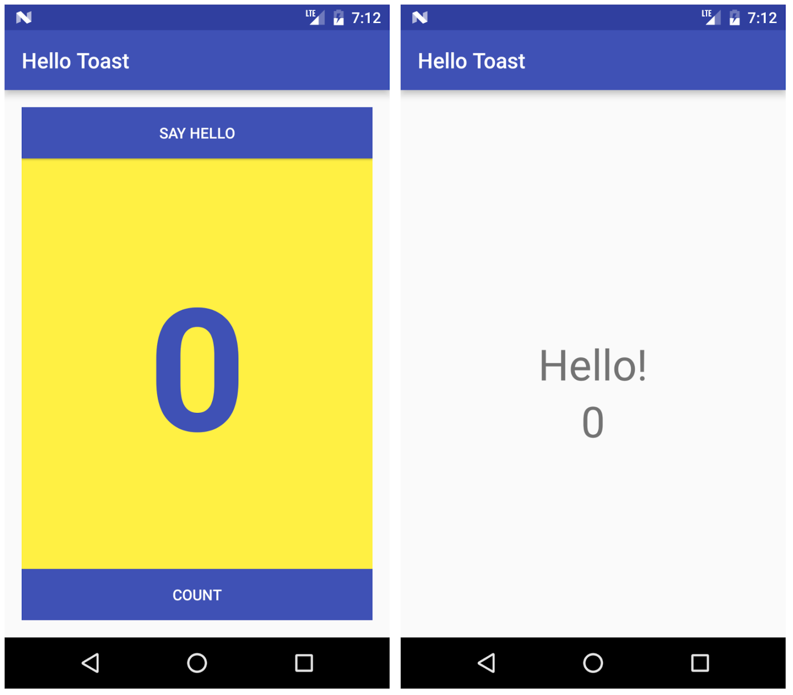

# Travail à faire

## Créer et exécuter une application

Ouvrez l'application HelloToast que vous avez créée dans une pratique antérieure.

1. Modifiez le bouton **Toast** pour qu'il lance une nouvelle activité et affiche le mot **"Hello!"** et le nombre actuel, comme indiqué ci-dessous.
2. Modifiez le texte sur le bouton `Toast` en **Say Hello**.

## Répondre à ces questions

### **Question 1**

Quelles modifications sont apportées lorsque vous ajoutez une deuxième activité à votre application en choisissant **File > New > Activity** et un modèle d'activité? Choisissez-en un:

- [ ] La deuxième activité est ajoutée en tant que classe Java. Vous devez toujours ajouter le fichier de mise en page (layout) XML.
- [ ] Le deuxième fichier de mise en page XML d'activité est créé et une classe Java ajoutée. Vous devez toujours définir la signature de la classe.
- [ ] La deuxième activité est ajoutée en tant que classe Java, le fichier de présentation (layout) XML est créé et le fichier `AndroidManifest.xml` est modifié pour déclarer une deuxième activité.
- [ ] Le deuxième fichier de présentation (layout) XML d'activité est créé et le fichier `AndroidManifest.xml` est modifié pour déclarer une deuxième activité.

### **Question 2**

Que se passe-t-il si vous supprimez les éléments `android:parentActivityName` et `<meta-data>` de la deuxième déclaration d'activité du fichier `AndroidManifest.xml`? Choisissez-en un:

- [ ] La deuxième activité n'apparaît plus lorsque vous essayez de la démarrer avec une intention (`Intent`) explicite.
- [ ] Le deuxième fichier de mise en page (layout) XML d'activité est supprimé.
- [ ] Le bouton Back (Précédent) ne fonctionne plus dans la deuxième activité pour renvoyer l'utilisateur à l'activité principale.
- [ ] Le bouton Up (Haut) de la barre d'applications n'apparaît plus dans la deuxième activité pour renvoyer l'utilisateur à l'activité parent.

### **Question 3**

Quelle méthode de constructeur utilisez-vous pour créer une nouvelle intention (`Intent`) explicite? Choisissez-en un:

- [ ] `new Intent()`
- [ ] `new Intent(Context context, Class<?> class)`
- [ ] `new Intent(String action, Uri uri)`
- [ ] `new Intent(String action)`

### **Question 4**

Dans l'application HelloToast (du Travail à faire), comment ajoutez-vous la valeur actuelle du comptage à l'intention (`Intent`)? Choisissez-en un:

- [ ] Comme les données d'intention (`Intent`)
- [ ] Comme `TEXT_REQUEST` de l'intention (`Intent`)
- [ ] En tant qu'action d'intention (`Intent`)
- [ ] Comme extra d'intention (`Intent`)

### **Question 5**

Dans l'application HelloToast (du Travail à faire), comment afficher le nombre actuel dans la deuxième activité "Hello"? Choisissez-en un:

- [ ] Obtenez l'intention (`Intent`) avec laquelle l'activité a été lancée.
- [ ] Obtenez la valeur actuelle du comptage de l'intention.
- [ ] Mettez à jour le `TextView` pour le comptage.
- [ ] Tout ce qui précède.

## Soumettez votre application pour la notation

Vérifiez que l'application dispose des éléments suivants:

* Il affiche le bouton **Say Hello** au lieu du bouton **Toast**.
* La deuxième activité commence lorsque le bouton **Say Hello** est enfoncé et affiche le message **"Hello!"** et le nombre actuel de `MainActivity`.
* Les fichiers de présentation (layout) XML et Java de la deuxième Activité ont été ajoutés au projet.
* Le fichier de présentation (layout) XML de la deuxième activité contient deux éléments `TextView`, l'un avec la chaîne **"Hello!"** et le second avec le compte.
* Il inclut une implémentation d'une méthode de gestion des clics pour le bouton **Say Hello** (dans `MainActivity`).
* Il inclut une implémentation de la méthode `onCreate()` pour la deuxième activité et met à jour le décompte `TextView` avec le décompte de `MainActivity`.
